# Entity-Relationship Diagram (ERD): Sistem Apotek Grapi (SaaS Multi-Tenant)

Dokumen ini merupakan acuan resmi struktur database relasional (*Relational Database Schema*) untuk sistem informasi apotek **Grapi**. Seluruh arsitektur data didesain dengan prinsip **Modular Monolith**, **Multi-Tenancy Isolation**, **Multi-Unit Pricing Hierarchy**, dan **FEFO (First Expired First Out) Inventory Ledger**.

---

## 1. Visualisasi ERD Lengkap (Mermaid Diagram)

```mermaid
erDiagram
    %% ==========================================
    %% TENANCY & AUTHENTICATION
    %% ==========================================
    tenants ||--o{ users : "has"
    tenants ||--o{ branches : "owns"
    tenants ||--o{ products : "manages"
    tenants ||--o{ product_categories : "categorizes"
    tenants ||--o{ suppliers : "partners_with"
    tenants ||--o{ customers : "services"
    tenants ||--o{ inventory : "tracks"
    tenants ||--o{ inventory_batches : "stores"
    tenants ||--o{ purchases : "procures"
    tenants ||--o{ sales : "transacts"
    tenants ||--o{ cashier_shifts : "audits"
    tenants ||--o{ debts : "finances"
    tenants ||--o{ expenses : "spends"

    %% ==========================================
    %% MASTER DATA & MULTI-UNIT
    %% ==========================================
    product_categories ||--o{ products : "classifies"
    suppliers ||--o{ products : "supplies"
    branches ||--o{ products : "allocates"
    products ||--|{ product_units : "has_units"
    product_units ||--o{ product_unit_prices : "tiered_prices"

    %% ==========================================
    %% INVENTORY & BATCH LEDGER (FEFO)
    %% ==========================================
    branches ||--o{ inventory : "holds"
    products ||--o{ inventory : "quantified_in"
    branches ||--o{ inventory_batches : "locates"
    products ||--o{ inventory_batches : "divided_into"
    branches ||--o{ stock_movements : "logs"
    products ||--o{ stock_movements : "moves"

    %% STOCK OPNAME
    branches ||--o{ stock_opnames : "conducts"
    users ||--o{ stock_opnames : "creates"
    stock_opnames ||--|{ stock_opname_details : "contains"
    products ||--o{ stock_opname_details : "audited"
    inventory_batches ||--o{ stock_opname_details : "batch_adjusted"

    %% STOCK TRANSFER (INTER-BRANCH)
    branches ||--o{ stock_transfers : "source_branch"
    branches ||--o{ stock_transfers : "destination_branch"
    users ||--o{ stock_transfers : "dispatches"
    stock_transfers ||--|{ stock_transfer_details : "includes"
    products ||--o{ stock_transfer_details : "transferred_product"

    %% ==========================================
    %% PURCHASING (INBOUND)
    %% ==========================================
    branches ||--o{ purchases : "orders_to"
    suppliers ||--o{ purchases : "billed_by"
    purchases ||--|{ purchase_details : "details"
    products ||--o{ purchase_details : "purchased_item"

    %% ==========================================
    %% POS, CASHIER SHIFT & SALES (OUTBOUND)
    %% ==========================================
    branches ||--o{ cashier_shifts : "shift_branch"
    users ||--o{ cashier_shifts : "cashier_user"
    cashier_shifts ||--o{ sales : "records_in_shift"
    branches ||--o{ sales : "outlet"
    users ||--o{ sales : "served_by"
    customers ||--o{ sales : "purchased_by"
    sales ||--|{ sales_details : "items"
    products ||--o{ sales_details : "sold_product"
    inventory_batches ||--o{ sales_details : "deducted_batch"

    %% SALES RETURN
    sales ||--o{ sales_returns : "returned_sale"
    users ||--o{ sales_returns : "approved_by"
    branches ||--o{ sales_returns : "processed_at"
    sales_returns ||--|{ sales_return_details : "refund_items"
    sales_details ||--o{ sales_return_details : "from_sale_item"
    products ||--o{ sales_return_details : "returned_product"
    inventory_batches ||--o{ sales_return_details : "restocked_batch"

    %% ==========================================
    %% DEBT & EXPENSE (FINANCE)
    %% ==========================================
    branches ||--o{ debts : "branch_debt"
    purchases ||--o{ debts : "payable_from_po"
    sales ||--o{ debts : "receivable_from_sale"
    debts ||--o{ debt_payments : "installments"
    branches ||--o{ expenses : "branch_expense"
    users ||--o{ expenses : "recorded_by"

    %% ==========================================
    %% ENTITY DEFINITIONS & ATTRIBUTES
    %% ==========================================
    tenants {
        varchar id PK
        varchar name
        varchar subscription_plan
        varchar status
        varchar whatsapp
        timestamp created_at
    }

    users {
        bigint id PK
        varchar tenant_id FK
        varchar username UK
        varchar password
        varchar email
        varchar role
        boolean active
        timestamp created_at
    }

    branches {
        bigint id PK
        varchar tenant_id FK
        varchar name
        text address
        varchar phone
        varchar branch_type
        boolean is_active
        timestamp created_at
    }

    product_categories {
        bigint id PK
        varchar tenant_id FK
        varchar name
        text description
    }

    suppliers {
        bigint id PK
        varchar tenant_id FK
        varchar name
        text address
        varchar phone
        varchar email
        varchar pic
    }

    customers {
        bigint id PK
        varchar tenant_id FK
        varchar name
        varchar phone
        text address
        varchar email
    }

    products {
        bigint id PK
        varchar tenant_id FK
        bigint branch_id FK
        bigint category_id FK
        bigint supplier_id FK
        varchar name
        varchar sku UK
        varchar barcode
        text description
        boolean active
        decimal min_stock
        timestamp created_at
    }

    product_units {
        bigint id PK
        bigint product_id FK
        varchar unit_name
        integer conversion_to_base
        boolean is_base_unit
        decimal price_per_unit
    }

    product_unit_prices {
        bigint id PK
        bigint product_unit_id FK
        varchar price_label
        decimal price
    }

    inventory {
        bigint id PK
        varchar tenant_id FK
        bigint branch_id FK
        bigint product_id FK
        decimal stock_quantity
    }

    inventory_batches {
        bigint id PK
        varchar tenant_id FK
        bigint branch_id FK
        bigint product_id FK
        varchar batch_number
        date expiry_date
        decimal current_quantity
        decimal purchase_price
        bigint version
        timestamp created_at
    }

    stock_movements {
        bigint id PK
        varchar tenant_id FK
        bigint branch_id FK
        bigint product_id FK
        varchar type
        decimal quantity
        varchar batch_number
        date expiry_date
        varchar reference_number
        text notes
        decimal purchase_price
        timestamp created_at
    }

    purchases {
        bigint id PK
        varchar tenant_id FK
        bigint supplier_id FK
        bigint branch_id FK
        date purchase_date
        varchar invoice_number
        decimal total_amount
        varchar status
        varchar payment_method
        text notes
        timestamp created_at
    }

    purchase_details {
        bigint id PK
        bigint purchase_id FK
        bigint product_id FK
        decimal quantity
        decimal unit_price
        varchar batch_number
        date expiry_date
        decimal subtotal
        timestamp created_at
    }

    cashier_shifts {
        bigint id PK
        varchar tenant_id FK
        bigint branch_id FK
        bigint user_id FK
        timestamp start_time
        timestamp end_time
        decimal starting_cash
        decimal ending_cash
        decimal actual_cash
        decimal difference
        varchar status
        text notes
    }

    sales {
        bigint id PK
        varchar tenant_id FK
        bigint branch_id FK
        bigint user_id FK
        bigint customer_id FK
        bigint shift_id FK
        varchar invoice_number UK
        timestamp sale_date
        decimal total_amount
        decimal discount_amount
        decimal tax_amount
        decimal grand_total
        varchar payment_method
        decimal cash_received
        decimal change_amount
        varchar status
        text notes
        timestamp created_at
    }

    sales_details {
        bigint id PK
        bigint sale_id FK
        bigint product_id FK
        bigint batch_id FK
        decimal quantity
        varchar unit_name
        integer conversion_factor
        decimal unit_price
        decimal discount
        decimal subtotal
        decimal cost_price
        timestamp created_at
    }

    sales_returns {
        bigint id PK
        varchar tenant_id FK
        bigint branch_id FK
        bigint user_id FK
        bigint sale_id FK
        bigint shift_id FK
        varchar return_number UK
        timestamp return_date
        decimal total_refund
        text reason
        varchar status
        timestamp created_at
    }

    sales_return_details {
        bigint id PK
        bigint sales_return_id FK
        bigint sale_detail_id FK
        bigint product_id FK
        bigint batch_id FK
        decimal quantity
        decimal refund_price
        decimal subtotal
    }

    debts {
        bigint id PK
        varchar tenant_id FK
        bigint branch_id FK
        bigint purchase_id FK
        bigint sale_id FK
        varchar type
        decimal total_amount
        decimal paid_amount
        decimal remaining_amount
        date due_date
        varchar status
        text notes
        timestamp created_at
    }

    debt_payments {
        bigint id PK
        bigint debt_id FK
        bigint user_id FK
        date payment_date
        decimal amount
        varchar payment_method
        text notes
        timestamp created_at
    }

    expenses {
        bigint id PK
        varchar tenant_id FK
        bigint branch_id FK
        bigint user_id FK
        date expense_date
        varchar category
        varchar expense_type
        decimal amount
        text notes
        timestamp created_at
    }

    stock_transfers {
        bigint id PK
        varchar tenant_id FK
        bigint source_branch_id FK
        bigint destination_branch_id FK
        bigint user_id FK
        varchar transfer_number UK
        varchar status
        text notes
        timestamp transfer_date
        timestamp created_at
    }

    stock_transfer_details {
        bigint id PK
        bigint transfer_id FK
        bigint product_id FK
        decimal quantity
        varchar batch_number
        date expiry_date
    }

    stock_opnames {
        bigint id PK
        varchar tenant_id FK
        bigint branch_id FK
        bigint user_id FK
        timestamp opname_date
        varchar status
        text notes
        timestamp created_at
    }

    stock_opname_details {
        bigint id PK
        bigint opname_id FK
        bigint inventory_batch_id FK
        bigint product_id FK
        decimal system_quantity
        decimal physical_quantity
        decimal difference
        varchar reason
    }
```

---

## 2. Pengelompokan Modul & Penjelasan Relasi Entitas

### A. Modul Tenancy & Hak Akses (Auth)
1. **`tenants`**: Inti dari sistem SaaS. Setiap tenant merepresentasikan 1 apotek/organisasi bisnis. Memiliki relasi `1-to-N` ke hampir semua tabel untuk isolasi data (*Multi-Tenancy Discriminator*).
2. **`users`**: Akun pengguna sistem (Super Admin, Owner, Admin/Apoteker, Staff, Kasir). Berelasi ke `tenants` melalui `tenant_id`.
3. **`branches`**: Outlet fisik/pusat apotek. Memungkinkan ekspansi apotek dari 1 cabang menjadi multi-cabang.

### B. Modul Master Data Obat & Multi-Satuan
1. **`products`**: Master barang/obat. Berelasi dengan `product_categories` (kategori obat), `suppliers` (distributor default), dan `branches` (lokasi produk).
2. **`product_units`**: Hirarki multi-satuan per produk:
   - Menyimpan *Base Unit* (Satuan terkecil: misal `TABLET`, conversion: `1`).
   - Menyimpan Satuan Menengah & Besar (misal `STRIP` = `10 TABLET`, `BOX` = `100 TABLET`).
3. **`product_unit_prices`**: Variasi harga dinamis per satuan (misal harga *Umum*, *Resep*, *Klinik*, *Grosir*).

### C. Modul Inventori & Batch FEFO (*The Heart of Pharmacy*)
1. **`inventory`**: Ringkasan saldo total stok per produk per cabang.
2. **`inventory_batches`**: Penyimpanan spesifik per lot/batch obat:
   - Mencatat `batch_number`, `expiry_date`, dan `current_quantity`.
   - Menggunakan `@Version` (*Optimistic Locking*) untuk mencegah *race condition* kasir saat pemotongan stok bersamaan.
3. **`stock_movements`**: *Immutable Ledger* (buku besar). Setiap pergerakan stok (Masuk, Keluar, Penyesuaian, Transfer) dicatat tanpa pernah mengubah baris historis.
4. **`stock_transfers` & `stock_transfer_details`**: Alur mutasi stok antar cabang (Pusat $\rightarrow$ Cabang atau sebaliknya).
5. **`stock_opnames` & `stock_opname_details`**: Rekonsiliasi audit fisik vs sistem dengan pencatatan selisih (*difference*) dan alasan penyesuaian.

### D. Modul Pengadaan (Purchasing / Inbound)
1. **`purchases`**: Faktur pembelian / Purchase Order dari PBF (distributor).
2. **`purchase_details`**: Rincian obat yang dipesan. Saat barang berstatus `RECEIVED`, data detail ini otomatis membuat `inventory_batches` baru dan menambah `stock_movements`.

### E. Modul Kasir (POS) & Retur Penjualan (Outbound)
1. **`cashier_shifts`**: Audit pergantian kasir. Mencatat modal kas awal, kas akhir yang dihitung fisik, kas menurut sistem, dan selisihnya.
2. **`sales`**: Transaksi kasir utama. Terhubung langsung dengan `cashier_shifts` aktif dan `customers`.
3. **`sales_details`**: Rincian obat yang terjual. Terhubung ke `inventory_batches` spesifik yang dipotong menggunakan algoritma **FEFO** (*First Expired First Out*).
4. **`sales_returns` & `sales_return_details`**: Pencatatan retur obat dari customer. Mengembalikan stok ke batch asal dan mencatat nilai pengembalian uang (*refund*).

### F. Modul Keuangan (Finance: Hutang, Piutang, Biaya)
1. **`debts`**: Pencatatan hutang ke supplier (dari `purchases` tempo) atau piutang pelanggan (dari `sales` kredit).
2. **`debt_payments`**: Cicilan pembayaran hutang/piutang secara bertahap.
3. **`expenses`**: Pengeluaran operasional apotek (gaji, listrik, sewa tempat, perlengkapan toko) per cabang.

---

> [!TIP]
> Dokumen ERD ini mencerminkan struktur database per migrasi Flyway terakhir (**V26**). Gunakan dokumen ini sebagai referensi utama saat menambahkan endpoint REST API baru atau membuat query laporan.
