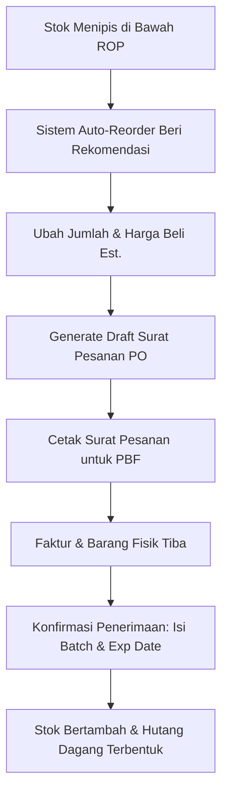

# 📖 Panduan Penggunaan Sistem Apotek Modern - Grapi (SaaS MVP)

Selamat datang di **Grapi**, platform Sistem Informasi Manajemen Apotek Modern berbasis Software-as-a-Service (SaaS). Sistem ini dirancang khusus untuk mengelola operasional apotek tunggal maupun jaringan multi-cabang dengan fitur canggih seperti sistem inventori FEFO (*First Expired First Out*), rekomendasi pemesanan otomatis (*Auto-Reorder*), Kasir (POS) responsif, hingga laporan laba rugi otomatis.

Dokumen ini adalah panduan operasional komprehensif bagi **Owner (Pemilik Apotek)**, **Apoteker (Staff)**, dan **Kasir** untuk memaksimalkan penggunaan aplikasi Grapi.

---

## 👥 1. Hak Akses & Peran Pengguna (User Roles)

Sistem Grapi menerapkan kontrol keamanan ketat berbasis peran (*Role-Based Access Control / RBAC*). Berikut adalah pembagian wewenang masing-masing peran:

| Fitur / Modul | Super Admin (Pusat) | Owner (Pemilik) | Admin / Apoteker | Staff / Asisten | Kasir (Cashier) |
| :--- | :---: | :---: | :---: | :---: | :---: |
| **Aktivasi Tenant SaaS** | 🟢 Ya | 🔴 Tidak | 🔴 Tidak | 🔴 Tidak | 🔴 Tidak |
| **Kelola Pengaturan Apotek** | 🔴 Tidak | 🟢 Ya | 🟢 Ya | 🔴 Tidak | 🔴 Tidak |
| **Kelola Pengguna (Tambah Staff/Kasir)** | 🔴 Tidak | 🟢 Ya | 🟢 Ya | 🔴 Tidak | 🔴 Tidak |
| **Input Master Data & Obat** | 🔴 Tidak | 🟢 Ya | 🟢 Ya | 🟢 Ya | 🔴 Tidak |
| **Buat Purchase Order (PO)** | 🔴 Tidak | 🟢 Ya | 🟢 Ya | 🟢 Ya | 🔴 Tidak |
| **Konfirmasi Penerimaan Barang** | 🔴 Tidak | 🟢 Ya | 🟢 Ya | 🟢 Ya | 🔴 Tidak |
| **Stock Opname (Penyesuaian)** | 🔴 Tidak | 🟢 Ya | 🟢 Ya | 🟢 Ya | 🔴 Tidak * (Dibatasi) |
| **Mutasi & Transfer Stok** | 🔴 Tidak | 🟢 Ya | 🟢 Ya | 🟢 Ya | 🔴 Tidak |
| **Transaksi Kasir (POS)** | 🔴 Tidak | 🟢 Ya | 🟢 Ya | 🟢 Ya | 🟢 Ya |
| **Manajemen Shift & Uang Kas** | 🔴 Tidak | 🟢 Ya | 🟢 Ya | 🟢 Ya | 🟢 Ya |
| **Laporan Laba Rugi & Keuangan** | 🔴 Tidak | 🟢 Ya | 🟢 Ya | 🔴 Tidak | 🔴 Tidak |

> [!NOTE]
> **Super Admin** adalah akun pusat administrator SaaS Grapi yang bertugas memvalidasi pendaftaran apotek baru, mengaktifkan status langganan, dan mengelola billing bulanan apotek.

---

## 🚀 2. Alur Penggunaan Awal (Onboarding & Setup)

Jika Anda baru pertama kali menggunakan Grapi sebagai Owner, ikuti langkah-langkah inisialisasi berikut untuk menyiapkan apotek digital Anda:

### Langkah A: Registrasi & Aktivasi Apotek
1. Buka halaman utama Grapi lalu klik **Daftar Apotek Baru**.
2. Lengkapi formulir pendaftaran:
   * **ID Apotek (Tenant ID):** Digunakan untuk URL akses unik Anda (contoh: `selafarma`).
   * **Nama Apotek:** Nama resmi apotek Anda (contoh: `Apotek Sela Farma`).
   * **Pilihan Paket:** Pilih paket langganan yang diinginkan (cth: *FREE TRIAL, BASIC, PREMIUM*).
3. Setelah mendaftar, akun Anda akan berstatus **PENDING**. 
4. Hubungi administrator pusat untuk melakukan konfirmasi aktivasi atau tunggu hingga sistem memproses verifikasi billing Anda.

### Langkah B: Pengaturan Identitas Apotek (Settings)
1. Setelah akun diaktifkan, masuk ke sistem menggunakan akun Owner Anda.
2. Navigasikan ke menu **Pengaturan (Settings)** di bagian kiri bawah sidebar.
3. Pada tab **Umum (General)**, lengkapi informasi identitas bisnis:
   * **Email Bisnis** & **Telepon:** Ditampilkan di kop struk belanja kasir dan surat pesanan.
   * **NPWP Apotek:** Untuk pelaporan pajak operasional.
   * **Alamat Lengkap:** Lokasi fisik apotek Anda.
4. Klik **Simpan Perubahan** untuk menyimpan data langsung ke database pusat.

---

## 📦 3. Manajemen Master Data (Persiapan Inventori)

Sebelum mencatat stok masuk atau menjual obat, Anda harus melengkapi master data pendukung terlebih dahulu.

### 🏢 A. Mengelola Cabang (Multi-Branch)
Jika apotek Anda memiliki lebih dari satu outlet:
1. Masuk ke menu **Cabang (Branches)**.
2. Klik **Tambah Cabang Baru**.
3. Isi nama cabang (misal: *Cabang Rawamangun*), alamat, dan nomor telepon aktif.
4. *Catatan:* Jumlah maksimum cabang yang dapat Anda buat dibatasi sesuai dengan paket langganan SaaS yang Anda pilih saat registrasi.

### 🏷️ B. Kategori & Satuan Obat (Unit of Measure)
1. Masuk ke menu **Kategori (Categories)** untuk mengelompokkan obat (misal: *Obat Bebas, Obat Keras, Alat Kesehatan, Suplemen*).
2. Tentukan konversi satuan secara disiplin.
   > [!IMPORTANT]
   > **ATURAN EMAS SATUAN (Base Unit Rule):**
   > Grapi menyimpan semua kalkulasi stok di database dalam bentuk **satuan terkecil (Base Unit)**, seperti *tablet, kapsul, atau pcs*.
   > * *Contoh:* Obat Paracetamol. 1 Box = 10 Strip. 1 Strip = 10 Tablet. Maka daftarkan dengan base unit **Tablet**.
   > * Saat barang masuk sebanyak 1 Box, sistem backend otomatis mengonversi dan menambahkan 100 Tablet ke stok aktif. Ini menghindari selisih stok desimal yang membingungkan.

### 💊 C. Pendaftaran Produk Obat (Products)
1. Buka menu **Produk (Products)**, lalu klik **Tambah Produk Baru**.
2. Isi informasi penting berikut secara akurat:
   * **Nama Obat:** Nama obat beserta dosisnya (contoh: *Amoxicillin 500mg*).
   * **SKU / Barcode:** Scan barcode fisik obat atau ketik kode SKU unik.
   * **Stok Minimum (Safety Stock):** Batas aman stok di rak. Jika stok berada di bawah angka ini, sistem akan memicu peringatan di dashboard.
   * **Harga Beli** & **Harga Jual (Pengecer):** Digunakan sebagai HPP dasar dan harga rilis kasir.
   * **Supplier Utama:** Petakan produk ini ke distributor PBF (*Pedagang Besar Farmasi*) terkait agar fitur *Auto-Reorder* dapat bekerja optimal.

---

## 🛒 4. Manajemen Pengadaan Barang (Purchasing Engine)

Grapi membagi proses pengadaan barang menjadi tiga fase aman: **Rekomendasi Cerdas -> Draft PO -> Penerimaan Fisik (Goods Receipt).**



### 🧠 A. Fitur Auto-Reorder Pintar berbasis Sales Velocity
Anda tidak perlu lagi mengecek kartu stok manual setiap hari untuk mengetahui obat apa yang habis. Grapi memiliki algoritma analisis cerdas:
1. Buka menu **Pembelian (Purchasing)**, klik tombol **Rekomendasi Reorder**.
2. Sistem akan menghitung rata-rata penjualan harian (*Sales Velocity*) obat tersebut dalam 30 hari terakhir.
3. Sistem secara otomatis menyarankan pembelian ulang jika stok aktif saat ini lebih kecil dari **Reorder Point (ROP)**:
   $$\text{ROP} = (\text{Sales Velocity} \times \text{Lead Time PBF 3 Hari}) + \text{Stok Minimum}$$
4. Anda dapat meninjau rekomendasi yang dikelompokkan otomatis berdasarkan **Supplier PBF**.
5. **Tip Fleksibel:** Anda dapat langsung mengedit kolom **Jumlah Disarankan** dan **Estimasi Harga Beli** langsung dari tabel sebelum memproses!
6. Klik **Buat Draf PO** untuk otomatis menghasilkan draf pesanan resmi per cabang.

### 📝 B. Membuat & Mencetak Surat Pesanan (PO)
1. Pada menu **Pembelian (Purchasing)**, Anda akan melihat Surat Pesanan berstatus **DRAFT**.
2. Klik tombol **Cetak Surat Pesanan**.
3. Sistem akan memunculkan pratinjau cetak dokumen berformat formal standar Apoteker Pengelola Apotek (APA) lengkap dengan kop cabang apotek Anda, nomor Surat Pesanan otomatis, serta tabel obat yang dipesan. 
4. Dokumen ini dapat langsung diprint atau disimpan sebagai PDF untuk dikirimkan ke sales PBF via WhatsApp.

### 🚚 C. Konfirmasi Penerimaan Barang (Goods Receipt)
Ketika barang fisik dikirim oleh PBF bersama dengan Faktur Fisik, lakukan penerimaan sistemik:
1. Buka detail pembelian yang berstatus **DRAFT** pada sistem.
2. Klik tombol **Terima Barang** di bagian kanan atas.
3. Di dalam modal dialog konfirmasi yang muncul:
   * **Nomor Faktur / Invoice:** Ketik nomor faktur resmi yang tertera di kertas fisik PBF (Wajib).
   * **Metode Pembayaran:** Pilih *CASH*, *TRANSFER*, atau *HUTANG (Tempo 30 Hari)*.
   * **Konfirmasi Detail Obat:**
     * Sesuaikan kembali kuantitas fisik yang benar-benar diterima di gudang/rak.
     * **Nomor Batch (Wajib):** Ketik nomor batch fisik obat untuk pelacakan hukum (BPOM).
     * **Tanggal Kedaluwarsa / Exp. Date (Wajib):** Isi tanggal kadaluwarsa obat untuk kebutuhan FEFO.
4. Klik **Konfirmasi & Terima**.
5. **Dampak Sistemik Otomatis:**
   * Status pembelian berubah menjadi **RECEIVED**.
   * Stok obat bertambah ke cabang tujuan di tabel inventori.
   * Jika metode pembayaran adalah *HUTANG*, catatan tagihan tempo secara otomatis tercatat di menu **Hutang (Debts)**.

---

## ⚖️ 5. Manajemen Inventori & Stok Kontrol

Apotek memiliki regulasi inventori yang ketat karena melibatkan masa kedaluwarsa obat. Grapi menyediakan fitur kontrol terintegrasi berikut:

### ⏱️ A. Kendali FEFO (First Expired First Out)
Sistem kasir Grapi dipersenjatai dengan *FEFO Engine*. Anda tidak perlu memilih batch obat mana yang akan dikurangi saat bertransaksi di kasir. 
* Ketika kasir melakukan penjualan, backend secara otomatis memotong stok dari batch obat yang memiliki **tanggal kedaluwarsa paling dekat** dan masih memiliki stok aktif yang cukup. 
* Riwayat potongan batch ini dicatat detail di dalam kartu mutasi stok.

### 🔄 B. Transfer Stok Antar Cabang (Stock Transfer)
Guna menghindari penumpukan obat kedaluwarsa di satu cabang sementara cabang lain kekurangan stok:
1. Masuk ke menu **Transfer Stok (Stock Transfer)**.
2. Klik **Buat Transfer Baru**.
3. Pilih **Cabang Asal** (pengirim), **Cabang Tujuan** (penerima), pilih produk, masukkan kuantitas transfer, serta pilih **Nomor Batch** spesifik obat yang akan dipindahkan.
4. Klik **Kirim Transfer**. Stok cabang asal akan berkurang secara real-time, dan stok cabang tujuan bertambah saat transfer dikonfirmasi.

### 🔍 C. Stock Opname (Penyesuaian Fisik)
Lakukan audit kecocokan stok fisik di rak dengan stok sistem secara berkala (misal: setiap akhir bulan):
1. Masuk ke menu **Stock Opname**.
2. Klik **Mulai Stock Opname**.
3. Pilih produk yang diaudit, ketik **Kuantitas Fisik Aktual** yang Anda hitung manual di rak.
4. Sistem otomatis menghitung selisih (selisih lebih/kurang) serta estimasi kerugian nominal akibat selisih tersebut.
5. Klik **Terapkan Penyesuaian** untuk memperbarui saldo stok sistem ke jumlah riil fisik.
6. *Keamanan:* Kasir (Cashier) dilarang menerapkan Stock Opname secara sepihak untuk menghindari manipulasi stok barang hilang.

---

## 💳 6. Transaksi Kasir POS (Point of Sales)

Modul kasir dirancang dengan estetika tinggi, responsif, dan mendukung transaksi berkecepatan tinggi di meja kasir.

```text
+---------------------------------------------------------------------------------+
|                                  KASIR (POS)                                    |
+---------------------------------------------------------------------------------+
|  [ Cari nama obat / Scan Barcode... ]                                  |  CART  |
|                                                                        | ------ |
|  +--------------------+  +--------------------+  +--------------------+|  ObatA |
|  | Paracetamol 500mg  |  | Amoxicillin 500mg  |  | Decolgen           ||  Qty 2 |
|  | Rp 1.500 / tab     |  | Rp 3.000 / cap     |  | Rp 2.500 / tab     ||        |
|  | Stok: 150 tab      |  | Stok: 80 cap       |  | Stok: 200 tab      ||  ObatB |
|  +--------------------+  +--------------------+  +--------------------+|  Qty 1 |
|                                                                        | ------ |
|  METODE PEMBAYARAN: [ CASH ] [ QRIS / TRANSFER ]                        | TOTAL  |
|  [ BAYAR & CETAK STRUK ]                                               | Rp 6rb |
+---------------------------------------------------------------------------------+
```

### 👤 A. Pembukaan & Penutupan Shift Kasir
Setiap kasir yang bertugas wajib melakukan rekonsiliasi kas:
1. Saat aplikasi dibuka di awal jam kerja, kasir harus mengisi **Modal Awal (Kas Pembuka)** di laci uang kasir (laci kas).
2. Selama shift berjalan, semua transaksi penjualan kasir akan diakumulasikan ke dalam shift tersebut.
3. Di akhir jam kerja, klik **Tutup Shift**, masukkan jumlah **Uang Fisik Aktual** di dalam laci uang.
4. Sistem otomatis mendeteksi selisih uang (jiga ada) dan menghasilkan laporan shift kasir yang dapat dicetak demi mencegah kebocoran dana keuangan apotek.

### 🛒 B. Proses Transaksi Penjualan
1. Buka menu **Kasir (POS)**.
2. Cari produk obat menggunakan kolom pencarian (dapat mengetik nama obat, SKU, atau langsung menembakkan scanner barcode fisik ke kemasan obat).
3. Klik produk untuk memasukkannya ke dalam **Keranjang Belanja (Cart)** di panel kanan.
4. Anda dapat memperbarui jumlah pembelian (*Qty*) atau memberikan diskon langsung per item jika berwewenang.
5. Pilih **Metode Pembayaran**:
   * **CASH (Tunai):** Ketik nominal uang yang diterima dari pelanggan. Sistem otomatis menghitung jumlah kembalian secara presisi.
   * **NON-TUNAI (QRIS / Debit / Transfer):** Catat referensi pembayaran non-tunai.
6. Klik **Bayar & Cetak Struk**.
7. Laci uang (Cash Drawer) otomatis terbuka, dan struk belanja ukuran kertas thermal (58mm/80mm) akan langsung tercetak via printer POS Anda.

---

## 📈 7. Laporan Keuangan & Analitik Laba Rugi

Semua data transaksi penjualan dan pengeluaran dikompilasi secara real-time ke dalam modul analitik eksekutif untuk membantu Anda mengambil keputusan bisnis strategis.

### 💰 A. Pencatatan Biaya Operasional (Expenses)
Guna mendapatkan perhitungan Laba Bersih yang akurat, Anda harus mencatat pengeluaran non-stok:
1. Buka menu **Pengeluaran (Expenses)**.
2. Klik **Tambah Pengeluaran**.
3. Pilih kategori biaya (misal: *Gaji Karyawan, Biaya Listrik & Air, Sewa Gedung, Operasional Kantor*), isi nominal, tanggal pengeluaran, serta catatan singkat.

### 📊 B. Laporan Laba Rugi Akurat (Profit & Loss)
1. Masuk ke menu **Laporan Laba Rugi (Profit & Loss)**.
2. Tentukan periode tanggal laporan yang ingin Anda lihat.
3. Sistem secara otomatis menyajikan laporan keuangan standar akuntansi:
   * **Pendapatan Kotor (Gross Revenue):** Total omset dari kasir POS.
   * **Harga Pokok Penjualan (HPP / Cost of Goods Sold):** Akumulasi harga beli obat yang terjual (dihitung akurat berdasarkan harga batch FEFO yang terpotong).
   * **Laba Kotor (Gross Profit):** Pendapatan Kotor dikurangi HPP.
   * **Beban Operasional (Operating Expenses):** Total pengeluaran non-stok yang Anda input di menu *Expenses*.
   * **Laba Bersih (Net Profit):** Laba Kotor dikurangi Beban Operasional.

### 📊 C. Analitik Obat Terlaris (Product Performance)
Di dalam menu **Laporan (Reports)**, Anda dapat melihat grafik visual interaktif yang menampilkan performa obat terlaris (*Fast-Moving Items*). Data ini sangat berguna untuk menentukan stok pengaman (safety stock) obat tertentu saat musim penyakit tertentu melanda.

---

## ⚠️ 8. Manajemen Risiko & Troubleshooting Umum

| Masalah yang Terjadi | Penyebab Utama | Solusi & Penanganan Mandiri |
| :--- | :--- | :--- |
| **Transaksi POS Gagal (Stok Tidak Cukup)** | Jumlah stok obat di database bernilai 0 atau tidak mencukupi kuantitas transaksi. | Pastikan Anda telah melakukan konfirmasi penerimaan barang fisik di menu pembelian untuk menambah stok, atau lakukan *Stock Opname* jika ada kesalahan input stok awal. |
| **Error 404 saat Refresh Halaman Web** | Routing React Router kehilangan konteks saat halaman di-refresh langsung di browser pada *Single JAR* production. | Aplikasi Grapi telah dilengkapi filter *catch-all routing*. Jika kendala berulang, pastikan file build frontend statis di dalam `/static` telah ter-deploy dengan sempurna di dalam file JAR. |
| **Nomor Batch Tidak Muncul di Kasir** | Obat dipotong menggunakan metode FEFO otomatis berdasarkan tanggal kedaluwarsa terdekat. | Anda dapat melihat detail batch obat mana saja yang terpotong untuk transaksi tersebut langsung di halaman **Riwayat Penjualan -> Detail Transaksi**. |
| **Uang Kasir Selisih Saat Tutup Shift** | Kesalahan pengembalian uang tunai kepada pembeli atau ada pengeluaran kasir yang tidak tercatat. | Selalu disiplin mencatat uang kas keluar di menu *Expenses* atau menu *Cash Out* kasir, serta gunakan wadah pemisah pecahan uang kembalian untuk meminimalkan human error. |

---

*Panduan Penggunaan Grapi - Versi MVP 1.0.0. Dibuat dengan penuh dedikasi untuk efisiensi apotek Anda.*
